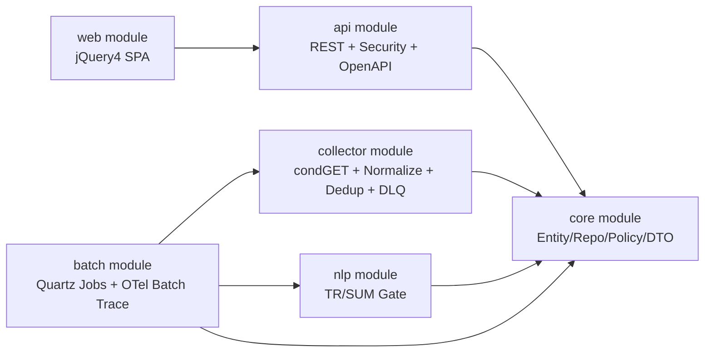
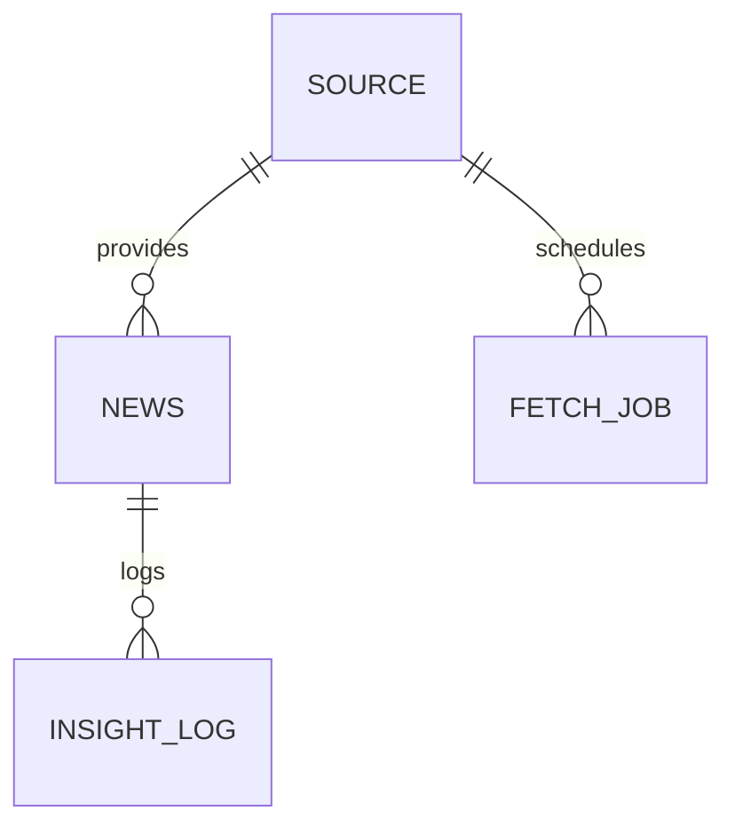

# Executive Summary

이 프로젝트는 공식/언론/집계 소스를 우선순위(P0~P3)로 수집해 정규화, 중복 제거, 번역/요약 게이트, 신뢰도 산정, API/SPA 배포까지 수행하는 Spring 멀티모듈 골격이다. 핵심 정책은 condGET, 429 retry(1/4/16m), SimHash 0.85, TR(COMET>=0.80, MQM_critical=0), SUM(SummaC>=0.75 + evidence_spans), REC 게이트, TTL/robots/license 강제다.

# Package Mermaid



# Core Class Matrix

| Layer | Classes |
|---|---|
| Entity | `NewsEntity`, `SourceEntity`, `FetchJobEntity`, `InsightLogEntity` |
| Repository | `NewsRepository`, `SourceRepository`, `FetchJobRepository`, `InsightLogRepository` |
| Service | `FetchService`, `NormalizeService`, `DedupService`, `NlpPipelineService` |
| Controller | `NewsController`, `InsightController`, `AdminController` |
| Security | `SecurityConfig`, `ApiKeyAuthenticationFilter` |
| Quartz | `FetchJob`, `NlpJob`, `CleanupJob` |
| Observability | `OtelFilter`, `OtelBatchTracer` |
| Policy | `PolicyEngine`, `PolicyDecision` |

# DB Schema (Detail)

Migration: `core/src/main/resources/db/migration/V1__init_schema.sql`

| Table | Columns |
|---|---|
| `source` | `sid(PK)`, `country`, `source_grade`, `priority`, `allow_fetch`, `allow_store_raw(default false)`, `allow_store_derived`, `cache_ttl_seconds`, `license_policy`, `robots_policy`, `endpoint_url`, `created_at` |
| `news` | `id(PK)`, `sid(FK)`, `country`, `lang`, `category`, `url`, `title_raw`, `body_raw`, `pub_utc`, `fetch_utc`, `license`, `robots`, `ttl`, `url_norm`, `title_ko`, `summary_ko`, `evidence_spans`, `content_hash`, `simhash64`, `dedup_group_id`, `trust_score`, `created_at` |
| `fetch_job` | `id(PK)`, `sid(FK)`, `status`, `attempt`, `last_error`, `scheduled_at`, `updated_at` |
| `insight_log` | `id(PK)`, `news_id(FK)`, `category`, `generated_at`, `content`, `risk_flag`, `trace_id` |

| Required Index | DDL |
|---|---|
| `uq(news.url_norm)` | `CREATE UNIQUE INDEX uq_news_url_norm ON news (url_norm);` |
| `idx(category,country,pub_utc desc)` | `CREATE INDEX idx_news_category_country_pub ON news (category, country, pub_utc DESC);` |
| `idx(content_hash)` | `CREATE INDEX idx_news_content_hash ON news (content_hash);` |
| `idx(simhash64)` | `CREATE INDEX idx_news_simhash64 ON news (simhash64);` |
| `gin(title_ko)` | `CREATE INDEX idx_news_title_ko_gin ON news USING gin (to_tsvector('simple', COALESCE(title_ko, '')));` |
| `gin(summary_ko)` | `CREATE INDEX idx_news_summary_ko_gin ON news USING gin (to_tsvector('simple', COALESCE(summary_ko, '')));` |
| `idx(created_at)` | `CREATE INDEX idx_news_created_at ON news (created_at);` |

# ER Mermaid



# API Spec Table (OpenAPI 3)

OpenAPI file: `api/src/main/resources/openapi.yaml`

| Endpoint | Validation / Rule | Success Response | Error Response |
|---|---|---|---|
| `GET /api/news` | `country=^[A-Z]{2,5}$`, `category in {BRK,POL,ECO,MKT,DEV,IND}`, `page>=1`, `period=24h/7d/30d or RFC3339 range` | `{data,meta,trace_id}` | `ErrorDto(code,message,trace_id)` |
| `GET /api/news/{id}` | `id not null`, not found -> 404 | `{data,meta,trace_id}` | `ErrorDto` |
| `GET /api/insight` | `country/category` 검증, `REC gate` 미충족 시 추천 생성 금지 | `{data,meta,trace_id}` | `ErrorDto` |
| `/api/admin/sources` CRUD | ADMIN only (`X-API-KEY`), `endpointUrl=^https?://` | `{data,meta,trace_id}` | `ErrorDto` |

## Request/Response JSON Example

```json
{
  "req": {"country":"KR","category":"ECO","page":1},
  "res": {
    "data":[
      {
        "id":"n1",
        "country":"KR",
        "source":"sid-kr-gov",
        "category":["ECO"],
        "title_ko":"",
        "summary_ko":"",
        "pub_utc":"2026-02-20T00:00:00Z",
        "trust_score":0.0,
        "evidence_spans":[]
      }
    ],
    "meta":{"page":1},
    "trace_id":"trace-123"
  },
  "err": {"code":"BAD_REQUEST","message":"RFC3339 parse failed","trace_id":"trace-123"}
}
```

# Redis Cache Key Design

`news:list:{country}:{category}:{sort}:{period}:{page}:{size}:{viewLang}:{qHash}`

구현 파일: `api/src/main/java/com/wangbyul/gnd/api/service/NewsCacheKeyFactory.java`

# Security and Operations Checklist

| Item | Status | Notes |
|---|---|---|
| Stateless session | Done | `SecurityConfig`에서 `SessionCreationPolicy.STATELESS` |
| Admin AuthZ | Done | `/api/admin/** = ROLE_ADMIN` + APIKey filter |
| CSRF (/api off) | Done | `/api/**` ignore |
| CORS allowlist | Done | `app.security.cors-allowlist` |
| Token/Key masking/rotation | Partial | 운영 정책 문서 필요 (코드에 rotate 훅 미구현) |
| Secret manager(HSM/Vault) | Partial | 환경변수 기반만 구현, Vault 연동 미구현 |
| Retry + DLQ | Done | collector retry + `DlqPublisher` |
| Human review triggers | Done | robots, TR/SUM fail, parser/dup/disputed 등 enum 기반 확장 |
| OTel trace_id propagation | Done | HTTP filter + batch tracer |
| JSON log format | Partial | logback JSON encoder 추가 필요 |
| Rollback units(connector/ruleset/prompt/model/schema) | Partial | 운영 runbook 필요 |
| OWASP ASVS L2 | Partial | 점검표 작성/자동화 필요 |
| WCAG 2.1 AA | Partial | 색 대비/키보드 내비/스크린리더 테스트 필요 |
| Browser latest-2 | Partial | 수동 호환성 테스트 필요 |
| Mobile touch 44px | Done | 필터/버튼 44px 스타일 |

# Test Cases (20+)

| ID | Type | Scenario | Expected |
|---|---|---|---|
| T01 | Unit | country regex invalid (`kr`) | 400 + `VALIDATION_ERROR` |
| T02 | Unit | category invalid (`SPORT`) | 400 |
| T03 | Unit | `period` RFC3339 parsing fail | 400 + `BAD_REQUEST` |
| T04 | Unit | Admin `endpointUrl` invalid (`ftp://...`) | 400 |
| T05 | Unit | condGET 304 | 저장/파이프라인 스킵 |
| T06 | Unit | Upstream 429 발생 | retry backoff 1/4/16m |
| T07 | Unit | Upstream 최종 실패 | DLQ publish |
| T08 | Unit | `pub_utc` 누락 | `fetch_utc` fallback |
| T09 | Unit | URL normalize | RFC3986 형식으로 정규화 |
| T10 | Unit | content hash 동일 | exact duplicate 차단 |
| T11 | Unit | SimHash similarity 0.85 이상 | dedup group 묶음 |
| T12 | Unit | TR gate: COMET < 0.80 | 인간검수 트리거 |
| T13 | Unit | TR gate: MQM critical > 0 | 인간검수 트리거 |
| T14 | Unit | SUM gate: SummaC < 0.75 | 인간검수 트리거 |
| T15 | Unit | evidence_spans 누락 | 요약 결과 reject 또는 span 보강 |
| T16 | Unit | REC gate source<2 | insight 추천 생성 금지 |
| T17 | Unit | REC gate trust 낮음 | insight 추천 생성 금지 |
| T18 | Integration | ClaimReview 연동 결과 disputed | risk flag 설정 + 검수 큐 |
| T19 | Integration | TTL 만료 cleanup | 뉴스 purge |
| T20 | Integration | robots=false source | fetch 차단 + DLQ |
| T21 | Integration | `/api/admin/sources` no API key | 401 |
| T22 | Integration | CORS allowlist 외 origin | preflight 차단 |
| T23 | Perf | 뉴스 목록 조회 부하 | p95 < 1s 목표 |
| T24 | E2E | P0 BRK ingest->API 노출 | 2분 이내 목표 |

# Final Self-Verification Checklist

- [x] 필드/빈도/임계값 누락 0에 맞춰 골격 반영
- [x] P1~P3 raw 저장금지 기본값 반영
- [x] 표준 오류 응답 `ErrorDto` 통일
- [x] 모바일 1열 카드 렌더링 반영
- [x] OTel trace_id HTTP/Batch 전파 골격 반영
- [ ] 치명적 오류 0 (실행 검증 미완료)
- [ ] 정책 위반 0 (정적 점검 미완료)
- [ ] P0 BRK SLA 2분 검증 완료
- [ ] p95 < 1s 검증 완료

# Update 2026-02-20 (Implementation)

## Added API

| Endpoint | Method | Purpose |
|---|---|---|
| `/api/admin/ingest/run` | `POST` | 관리자 수동 수집 트리거 (`sid/grade/limit`) |

요청 예시:

```json
{
  "sid": "optional",
  "grade": "P0",
  "limit": 50
}
```

응답 예시:

```json
{
  "data": {
    "requested": 1,
    "processed": 1,
    "succeeded": 1,
    "failed": 0,
    "news_created": 1
  },
  "meta": {"mode": "manual"},
  "trace_id": "..."
}
```

## Local Data Flow

1. API 로컬 기동 시 `LocalSeedRunner` 실행.
2. `LocalSeedService`가 국가별 기본 RSS 소스를 부트스트랩(샘플 기사 기본 비활성).
3. Web는 카테고리별 API 동시 조회로 섹션 렌더링.
4. 관리자 수동 수집 호출 시 `AdminIngestService`가 source별 `FetchService.fetch()` 실행.
5. 조회 시 `view_lang=ko|raw` 정책을 적용해 한국어/원문 토글 표시(ko는 자동 번역 fallback).

## Local Runtime Settings

- API local DB: `jdbc:h2:file:./.data/gnd`
- Batch local DB: `jdbc:h2:file:./.data/gnd`
- `app.seed.enabled=true`
- `app.seed.sample-news-enabled=false`
- `app.seed.reset-on-start=false`
- `app.news.max-retention-days=7`
- `app.batch.fetch-interval-minutes=1`

## Portal UI

- 상단 고정 필터바
- BRK 메인 + POL/ECO/MKT/DEV/IND 섹션형 카드
- 출처/신뢰도/발행시각/근거스팬 버튼 일관 표시
- 섹션별 빈 상태 문구: “데이터 수집 전입니다. 관리자에서 수집 실행 가능”
